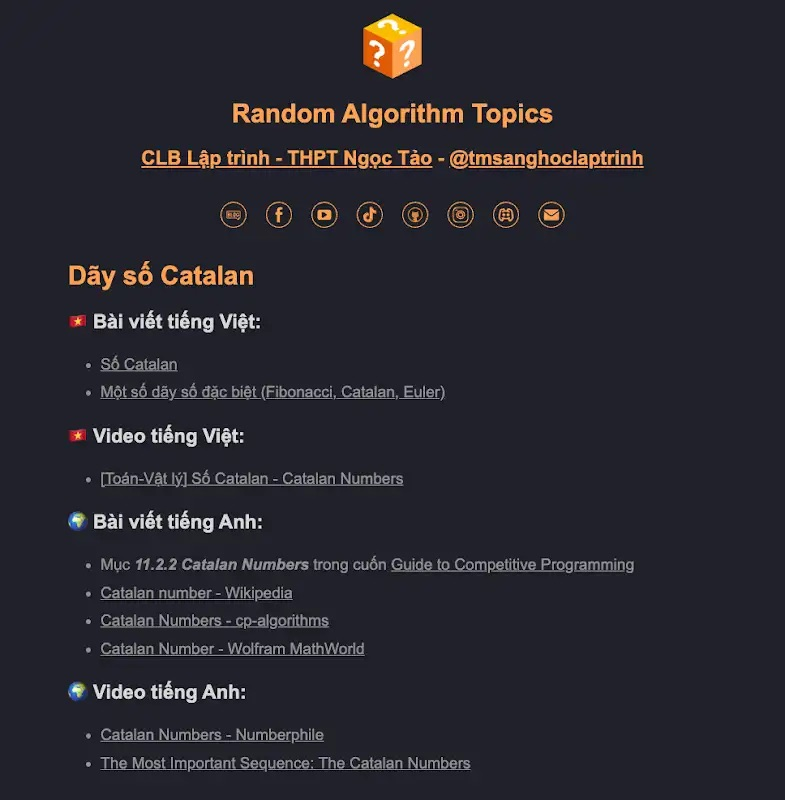

# [Tờ Mờ Sáng học Thuật toán và Lập trình thi đấu](/README.md)

# Thiết kế giải thuật

> Tổng hợp danh sách những tài liệu hay và bổ ích về **Thuật toán và Lập trình thi đấu**
> 
> Người tổng hợp: **[Trần Minh Sáng](https://www.facebook.com/sangtran.04/)**

  
  

  
  
  
  

  
  

### Series video "Lên trình Thuật toán - Lập trình thi đấu": 

## Cài đặt extension [Random Algorithm Topics](https://chromewebstore.google.com/detail/random-algorithm-topics/cfbnefdpfhohjhehglbjkchobnaknbkm) trên Google Chrome để học ngẫu nhiên một chủ đề trong danh sách mỗi khi mở 1 tab mới trên trình duyệt

 [Install on Google Chrome](https://chromewebstore.google.com/detail/random-algorithm-topics/cfbnefdpfhohjhehglbjkchobnaknbkm)

## Nội dung chính của phần "Thiết kế giải thuật"

- [Bit-Parallel Algorithms](#bit-parallel-algorithms)
  - [Hamming Distances](#hamming-distances)
  - [Counting Subgrids](#counting-subgrids)
  - [Reachability in Graphs](#reachability-in-graphs)
- [Amortized Analysis](#amortized-analysis)
  - [Two Pointers Method](#two-pointers-method)
  - [Nearest Smaller Elements](#nearest-smaller-elements)
  - [Sliding Window Minimum](#sliding-window-minimum)
- [Finding Minimum Values](#finding-minimum-values)
  - [Ternary Search](#ternary-search)
  - [Convex Functions](#convex-functions)
  - [Minimizing Sums](#minimizing-sums)

## Bit-Parallel Algorithms

### Hamming Distances

- Bài viết tiếng Việt:
    - [Khoảng cách Hamming](https://vi.wikipedia.org/wiki/Kho%E1%BA%A3ng_c%C3%A1ch_Hamming)
- Video tiếng Việt:
    - [VOI 12: Khoảng cách Hamming - VNOJ](https://www.youtube.com/watch?v=epbCzPsNNzY)
- Bài viết tiếng Anh:
    - Mục ***8.1.1 Hamming Distances*** trong cuốn [Guide to Competitive Programming](https://drive.google.com/file/d/1-V14oys49VJM6oipdcaIGcLzakaR_Hkn/view)
    - [Hamming distance - Wikipedia](https://en.wikipedia.org/wiki/Hamming_distance)
    - [What is Hamming Distance?](https://www.tutorialspoint.com/what-is-hamming-distance)
    - [Minimum Hamming Distance](https://www.geeksforgeeks.org/minimum-hamming-distance/)
    - [Hamming distance between two Integers](https://www.geeksforgeeks.org/hamming-distance-between-two-integers/)
- Video tiếng Anh:
    - [Error Correcting Codes: What is Hamming Distance and Minimum Hamming Distance?](https://www.youtube.com/watch?v=7SVSXiWc0-o)
    - [How to compute the Hamming distance](https://www.youtube.com/watch?v=P02mJhS9qQ4)
    - [Checksums and Hamming distance](https://www.youtube.com/watch?v=ppU41c15Xho)
    - [Hamming Distance | LeetCode 461 | C++, Java, Python](https://www.youtube.com/watch?v=5UKMvO5bXPI)

### Counting Subgrids

- Bài viết tiếng Anh:
    - Mục ***8.1.2 Counting Subgrids*** trong cuốn [Guide to Competitive Programming](https://drive.google.com/file/d/1-V14oys49VJM6oipdcaIGcLzakaR_Hkn/view)

### Reachability in Graphs

- Bài viết tiếng Anh:
    - Mục ***8.1.3 Reachability in Graphs*** trong cuốn [Guide to Competitive Programming](https://drive.google.com/file/d/1-V14oys49VJM6oipdcaIGcLzakaR_Hkn/view)

## Amortized Analysis

### Two Pointers Method

Đang cập nhật

### Nearest Smaller Elements

Đang cập nhật

### Sliding Window Minimum

Đang cập nhật

## Finding Minimum Values

### Ternary Search

Đang cập nhật

### Convex Functions

Đang cập nhật

### Minimizing Sums

Đang cập nhật
